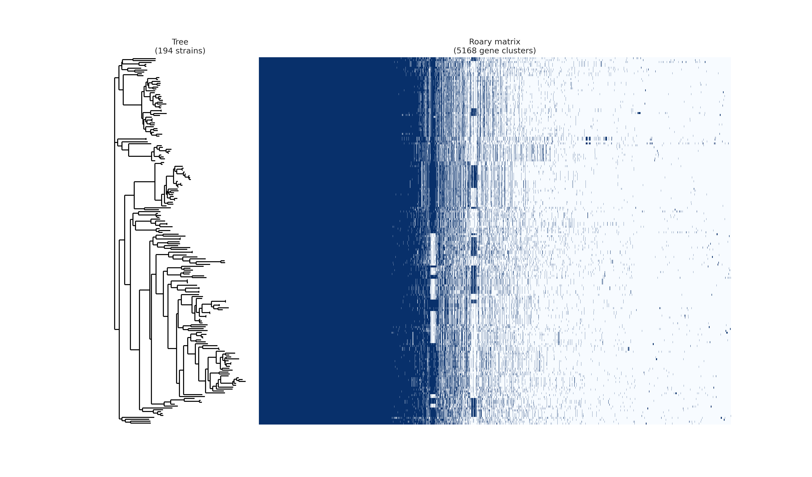

# Identification of a Potential Therapeutic Target in Neisseria gonorrhoeae Using Pan-Genomics, Subtractive Proteomics and Structure-Based Drug Repurposing

## 🧬 Background
Neisseria gonorrhoeae is a multidrug-resistant pathogen responsible for gonorrhea and represents a growing global health concern due to increasing antimicrobial resistance. This in-silico study aimed to identify novel therapeutic targets using pan-genomics and subtractive proteomics approaches across 194 genomes. Core genes were screened for essentiality and non-human homology, leading to the identification of 28 potential drug targets. Structural modeling, molecular dynamics simulations, and structure-based virtual screening were performed to identify high-affinity ligands. Two promising lead compounds were identified for further experimental validation.

## 🎯 Objective
To identify novel drug targets and potential small-molecule inhibitors against multidrug-resistant Neisseria gonorrhoeae using in-silico bioinformatics approaches.

## 🛠️ Methodology
Pan-genome Analysis → Essential Gene Identification → Non-human Homology Filtering → DrugBank Screening → Structure Prediction → Molecular Dynamics Simulation → Virtual Screening → MM/GBSA Refinement

## 📊 Key Results
- 1,566 core genes identified
- 28 prioritized novel drug targets
- 4 cytoplasmic proteins
- 7 high-affinity ligands identified
- 2 promising lead compounds

## 📈 Selected Visualizations

  

  

  

  

